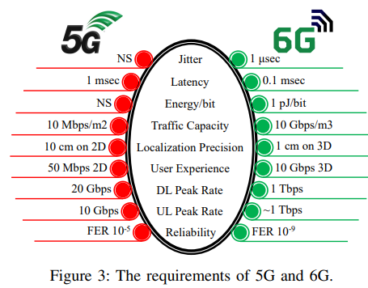

- Jitter
-
- Latency
-
- 每bit能量
-
- 话务容量
-
- 定位精度
-
- 用户体验
-
- 下行速率
-
- 上行速率
-
- 可靠性
- 
- Ref:
- A Comprehensive Survey on 6G Networks: Applications, Core Services, Enabling Technologies, and Future Challenges (Arxiv 2101.12475)