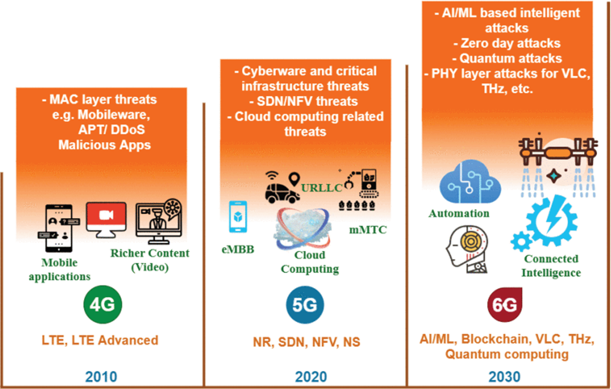

- 6G时代的新的攻击类型：
	- AI的智能攻击
	- 零日漏洞
	- 量子攻击
	- [[VLC]]、[[THz]]的物理层攻击
- [[5G]]时代的攻击
	- 基础设施威胁
	- [[SDN]] [[NFV]] 威胁
	- 云计算相关的威胁
- [[4G]] 时代的攻击
	- 移动恶意软件
	- [[APT]]
	- [[DDoS]]
- 
-
- Ref:
- Paper: The Roadmap to [[6G]] Security and Privacy
-