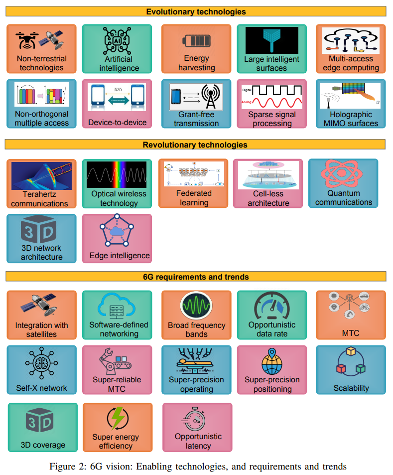

- 演进型技术
	- 非地面通信
	- AI
	- 能量收集？
	- 大型智能表面
	-
- 革命性技术
	- [[THz]]
	- [[VLC]]
	- 联邦学习
	- 无蜂窝架构
- 需求和趋势
-
- 
-
- Ref:
- A Comprehensive Survey on 6G Networks: Applications, Core Services, Enabling Technologies, and Future Challenges (Arxiv 2101.12475)