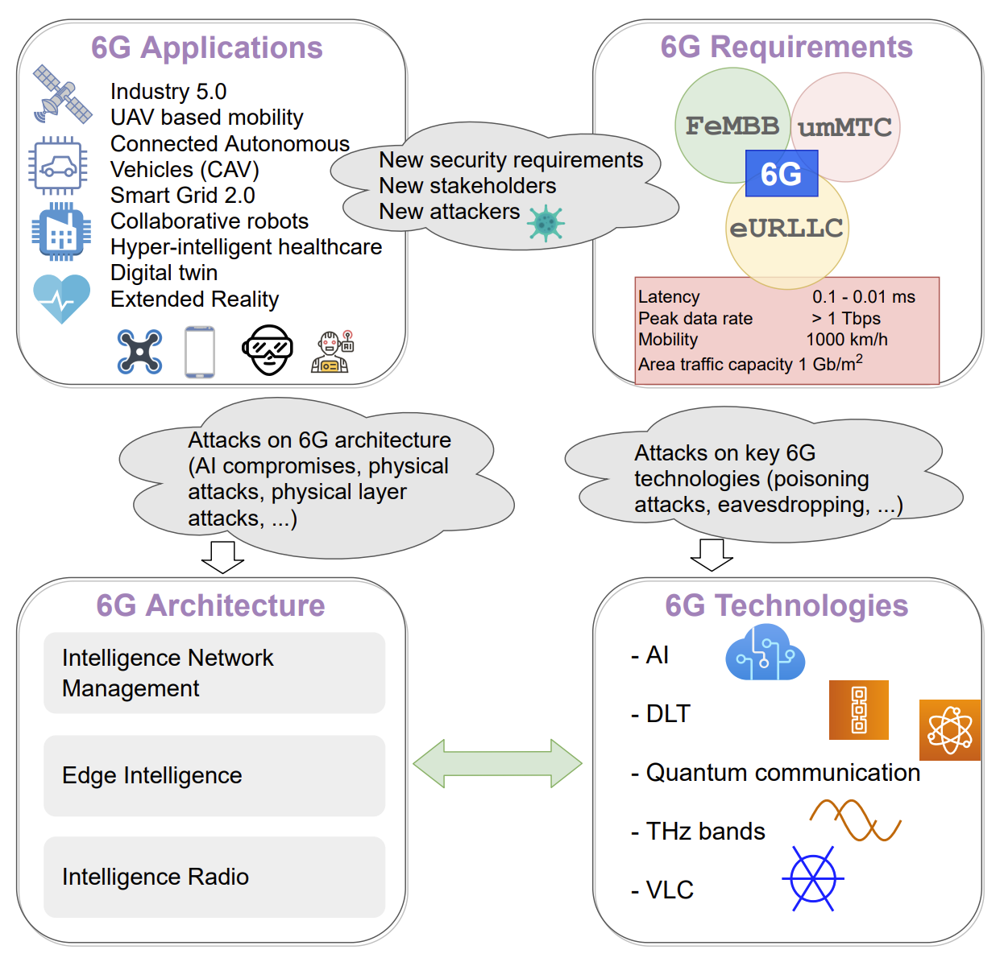

- [[6G Applications]]
	- Industry 5.0
	- [[UAV]] based mobility
	- 连接的自动驾驶车辆(CAV)
	- [[Smart Grid]] 2.0
	- 协作机器人（Collaborative robots）
	- Hyper-intelligent Healthcare
	- [[Digital Twin]]
	- [[Extended Reality]]
- [[6G Requirements]]
	- [[FeMBB]]
	- [[umMTC]]
	- [[eURLLC]]
-
- 
-