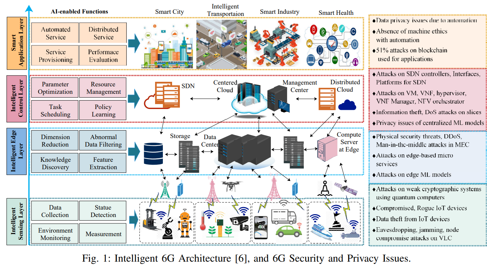
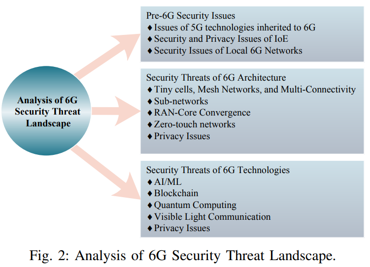
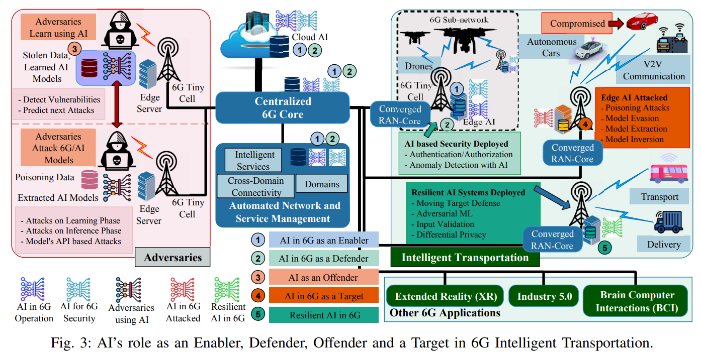

- Intelligent 6G Architecture, and #6G Security and Privacy Issues.
- 
- Analysis of 6G Security Threat Landscape
- 
- AI's role in 6G Transportation
- 
- Ref:
- AI and 6G Security: Opportunities and Challenges (Yushan Siri)
-