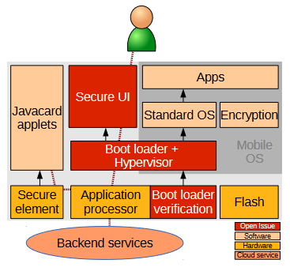

- Mobile devices such as smart phones have become one of the preferred means of accessing digital services, both for consuming and creating content. Unfortunately, securing such mobile devices is inherently difficult for a number of reasons. In this article, we review recent research results, systematically analyze the technical issues of securing mobile device platforms against different threats, and discuss a resulting and currently unsolved problem: how to create an end- to-end secure channel between the digital service (e.g. a secure wallet application on an embedded smart card or an infrastructure service connected over wireless media) and the user. Although the problem has been known for years and technical approaches start appearing in products, the user interaction aspects have remained unsolved. We discuss the reasons for this difficulty and suggest potential approaches to create human-verifiable secure communication with components or services within partially untrusted devices.
- {:height 351, :width 367}
-
- https://www.researchgate.net/publication/261638254_An_Architecture_for_Secure_Mobile_Devices