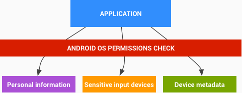

- Android 提供了一个适用于移动设备的开放源代码平台和应用环境。核心操作系统基于 Linux 内核。Android 应用通常都是使用 Java 编程语言编写的，并在 [[Dalvik]] 虚拟机中运行。不过，也可以使用原生代码编写应用。应用是通过文件扩展名为 .apk 的单个文件安装的。
- Android 应用的主要构造模块包括：
	- AndroidManifest.xml：[[AndroidManifest]].xml 文件是一个控制文件，用于告诉系统如何处理应用中的所有顶层组件（具体来说就是下面介绍的 Activity、服务、广播接收器和内容提供程序）。该文件还用于指定需要哪些权限。
	- Activity：Activity 通常是指面向用户的单个任务的代码，通常包括向用户显示界面，但也并非一定如此，有些 Activity 就从不显示界面。通常情况下，应用的入口点是应用的其中一个 Activity。
	- 服务：Service 是指在后台运行的一段代码。服务可以在自己的进程中运行，也可以在其他应用的进程中运行。其他组件会“绑定”到某项服务，并通过远程过程调用来调用该服务的方法。比如媒体播放器就是一项服务：即使用户退出媒体选择界面，大概也仍然希望音乐继续播放。即使界面已关闭，服务也可使音乐继续播放。
	- 广播接收器：[[BroadcastReceiver]]是一种对象，该对象会在操作系统或其他应用发出称为 Intent 的 IPC 机制时实例化。例如，应用可以注册一个接收器来接收电量不足的消息，并可以根据该信息改变自己的行为。
-
- **Android 权限模型** —— 受保护的API
- Android 上的所有应用均在应用沙盒([[App sandbox]])内运行。默认情况下，Android 应用只能访问有限的系统资源。系统负责管理 Android 应用对资源的访问权限。如果资源使用不当或被恶意使用，可能会给**用户体验**、**网络**或设备上的**数据**带来不利影响。
- 有三种限制方式：
	- 不支持相应API。如没有操作[[SIM]]卡的API。
	- 角色分离加上每应用独立存储。
	- 使用权限防护（Permission）
- 部分权限，如发送[[SMS]]广播Intent, 第三方App无法使用。以  signatureOrSystem permission 限制。
- **进程间通信(IPC)**
- 传统 Linux 进程间通信的机制仍然有效：文件系统、local sockets, Signals.
- 新的通信机制有：
	- [[Binder]]: 轻量级，基于capability的远程过程调用机制。使用定制的Linux驱动实现。
	- Services
	- [[Intent]]s
	- [[ContentProvider]]
- 虽然可以使用其他机制（例如Network sockets或全局可写文件）实现IPC，但这些是推荐的Android IPC框架。 将鼓励Android开发人员使用确保用户数据并避免引入安全漏洞的最佳实践。
- 成本敏感API
- 指对用户或者网络造成成本的功能。
	- 电话([[Telephony]])
	- [[SMS]], [[MMS]]
	- 上网或数据
	- App内账单
	- NFC访问
- **SIM卡访问**
	- Android 封装了SIM卡的访问，App无法使用。包括SIM卡上的通信录。也无法使用AT命令，该系列命令由 [[RIL]] (Radio Interface Layer) 处理。
- 个人信息
	- 安卓系统已将提供访问用户数据的API置于受保护的API集合中。随着正常使用，安卓设备也会在用户安装的第三方应用程序内积累用户数据。选择分享这些信息的应用程序可以使用安卓操作系统的权限检查来保护数据不被第三方应用程序获取。
	- 
- 权限检查保护三类信息：
	- 个人信息
	- 敏感输入设备
	- 设备元数据
-
- [TODO]
-
- Prev: [[Android System and kernel security]]
-