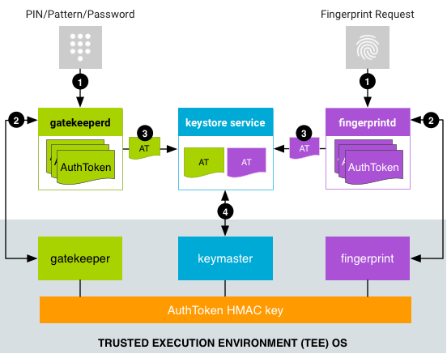

- Android 采用通过用户身份验证把关的加密密钥机制，该机制需要以下组件：
	- 加密密钥存储和服务提供程序。存储加密密钥并基于这些密钥提供标准加密例程。Android 支持由硬件支持的密钥库([[Android Keystore]])和 [[Keymaster]]这两种加密服务，其中包括由硬件支持的密钥存储加密服务，该服务可能包括可信执行环境 (#TEE) 或安全元件 ([[Secure Element]], SE)，例如 [[Strongbox]]。
	- 用户身份验证程序。证明相应用户存在并/或已成功通过身份验证。Android 支持 [[Gatekeeper]]（用于 PIN 码/解锁图案/密码身份验证）和 [[Fingerprint]]（用于指纹识别身份验证）。搭载 Android 9 及更高版本的设备可以使用 [[BiometricPrompt]] 作为指纹和其他生物识别技术的单一集成点。这些组件通过已经过身份验证的渠道与密钥库服务沟通身份验证状态。（密钥库服务还支持框架级 Android Keystore 系统。）
- Gatekeeper、Fingerprint 和 Biometric [[Android Biometrics]] 组件能够与密钥库及其他组件协同运作，以支持使用由硬件支持的身份验证令牌 ([[AuthToken]])。
- 
-
- [[Protected Confirmation]]
-
- Ref: https://source.android.google.cn/security/authentication
-