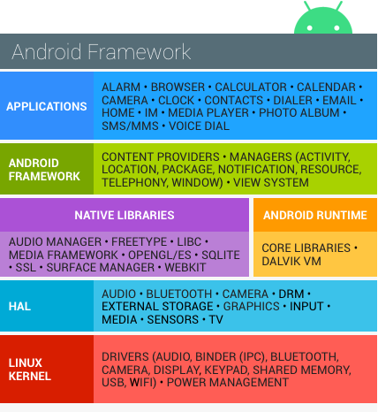

- 开放
	- App环境，保护用户、数据、App、设备和网络的 [[CIA]]。
	- 开放的平台需要安全架构、安全程序。
	- [[Android]] 使用多层安全（[[Multilayered Security]]架构。
	- 支持漏洞上报、[安全更新](https://source.android.google.cn/docs/security/overview/updates-resources)
- 开发者友好
	- 灵活的安全控制措施
	- 默认保护
	- 专业安全团队
	- [[Google Play Protect]]
	- App间通信([[OpenSSL]] 和测试工具 [[nogotofail]])
- 用户友好
	- 可视化 App 权限，并且可控制
	- 安全补丁机制
- 背景
	- Android software stack
	- 分层架构中，每一层都假设下层的安全。
	- {:height 474, :width 428}
	- 主要构建块
		- 设备**硬件**：处理器独立，不过可以利用硬件安全特性，如 [[ARM]] [[eXecute-Never]].
		- **Android OS**：基于 Linux Kernel 构建。
		- App**运行时**：绝大部分App使用 [[Java]]、[[Kotlin]] 编写，并运行在 [[ART]] 虚拟机。部分系统进程是Native App。
		- 应用：含预装应用和用户安装的应用。
- Google security services
	- Google基于 [[GMS]] 提供了安全服务。不属于 [[AOSP]] 范围。参考 [2018
	  Year in Review](https://source.android.google.cn/static/docs/security/reports/Google_Android_Security_2018_Report_Final.pdf) .
	- Google Play: 提供社区检视、License verification, App安全扫描和其它安全服务；
	- Android更新：提供Web更新以及 [[OTA]]。
	- App服务：支持App使用云能力（[backing
	    up](https://developer.android.google.cn/guide/topics/data/backup) )备份App数据与配置； [[C2DM]] 推送消息。
	- 验证App：警告或者自动阻止恶意应用安装；持续扫描设备的App；警告或者移除恶意程序；
	- [[SafetyNet]]: 保护隐私的 [[IDS]] （入侵检测系统），跟踪、环境已知的安全威胁，识别新安全威胁。
	- SafetyNet 证明：确定设备是否兼容 [[CTS]] 的第三方 API。 证明还可以识别与应用服务器通信的 Android 应用。
	- Android Device Manager：识别被窃的设备。
- **安全流程概述**
	- **设计检视**：使用可配置的安全模型与设计，在早期做检视。平台的每个主要功能都由工程和安全专家检视。
	- **渗透测试和代码检视**：Android 自研模块和开源模块，都由Android安全团队、Google信息安全工程团队、独立安全顾问检视。目的是发布前发现潜在的漏洞。
	- 开源和社区检视
	- 事件响应：完善的安全响应流程。漏洞修复、App下架等。
	- 月度安全更新。( [monthly
	    updates](https://source.android.google.cn/docs/security/bulletin) )
- Platform security architecture
	- 保护App和数据
	- 保护系统资源（含网络）
	- 提供App与系统的隔离；App之间的隔离；App与用户的隔离；
- 关键安全特性
	- Linux Kernel提供的安全
	- 强制 App沙箱
	- 安全的进程间通信
	- APP签名
	- App定义和用户授予的权限
	-
- Next: [[Android System and kernel security]]