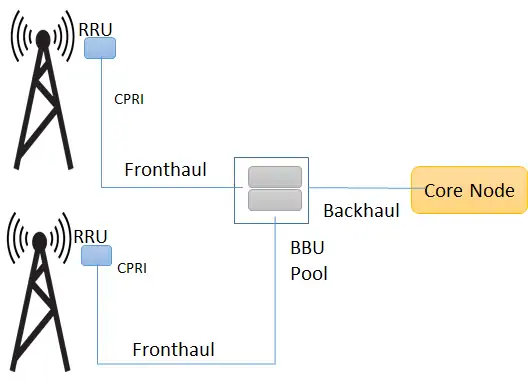
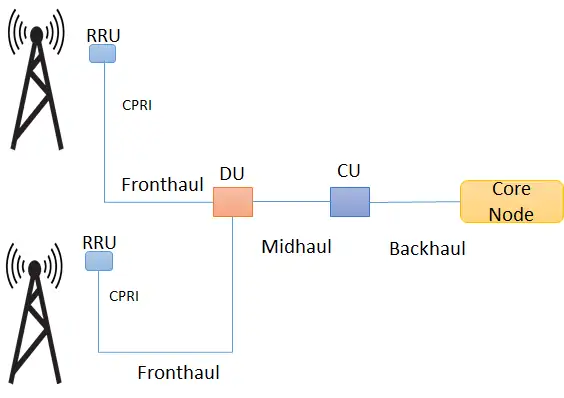

- In C-RAN Network Visualization is done at Baseband Unit (BBU) pool level. BBU will act as a virtual node and the link between them is Virtual Link. The pool will operate at one physical Virtual machine sharing CPU. Remote Radio Unit (RRU) will be connected to BBU, which will distribute them over virtual machine. This technology will offer many advantages such as cost reduction and minimization of time requirement and most important is scalability.
- Option 1:
- 
- Option 2:
- 
- https://www.geeksforgeeks.org/cloud-radio-access-network-c-ran/