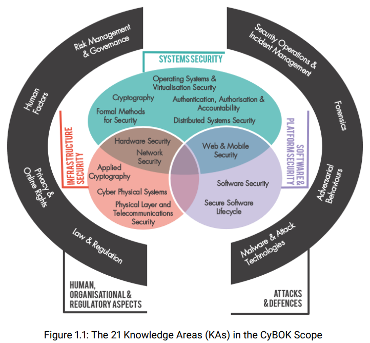

- https://www.cybok.org/
- 一个全面的知识体系，为网络安全领域的教育和专业培训提供信息和支持。
- 
- 其定义了21个知识领域：
- 人、组织和监管维度
	- 风险管理和治理：安全管理系统和组织的安全控制，涵盖标准，最佳实践，风险评估和缓解
	- 法律和监管：国际和国内的法律和监管要求，合规要求，安全道德，包含数据保护和网络战的理论
	- 人因（[[Human Factors]]）：可用的安全、影响安全的社会和行为因素、安全文化和意识以及安全控制对用户行为的影响。
	- 隐私和线上权利：保护个人信息的技术，包括通信、应用和数据库及数据处理的推论。它还包括其他支持在线权利的系统，涉及审查和规避、隐蔽性、电子选举、以及支付和身份系统中的隐私。
- 攻击和防御
	- 恶意软件和攻击技术：漏洞利用的技术细节，分布式恶意系统，以及发现和分析过程。
	- 敌手行为：攻击者的动机、行为和方法，包括恶意软件供应链，攻击向量，金钱转移。
	- 安全运营和事件处理：安全系统的配置、操作和维护，包括检测和应对安全事件以及收集和使用威胁情报。
	- 取证：收集、分析和报告数字证据以支持事件或犯罪活动。
- 系统安全
	- 密码学（ [[Cryptography]] ）：目前实行的密码学和新兴算法的核心原语，分析这些原语的技术，以及使用这些原语的协议。
	- 操作系统和虚拟化安全
	- 分布式系统安全
	- 形式化方法([[Formal methods]])
	- 3A ([[AAA]])
- 软件与平台安全
	- 软件安全
	- Web和移动安全
	- 安全软件生命周期([[SDLC]])
- 基础设施安全
	- 应用密码学([[Cryptography]])
	- 网络安全([[Network security]])
	- 硬件安全([[Hardware Security]])
	- [[CPS]]安全
	- 物理层和传输安全
-