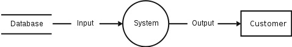

- **数据流图**是一种表示通过流程或系统（通常是信息系统）的数据流的方式。 DFD 还提供有关每个实体的输出和输入以及流程本身的信息。数据流图没有控制流 — 没有决策规则，也没有循环。基于数据的具体操作可以用流程图来表示。
- 
- 具有数据存储、数据流、功能和接口的数据流图
  有几种显示数据流图的符号。上述符号在 1979 年由 Tom DeMarco 作为结构化分析的一部分进行了描述。
- 对于每个数据流，至少一个端点（源和/或目标）必须存在于进程中。流程的细化表示可以在另一个数据流程图中完成，该流程图将这个流程细分为子流程。
- 数据流程图是一种工具，是结构化分析和数据建模的一部分。使用 UML 时，活动图通常会取代数据流图的角色。一种特殊形式的数据流计划是面向站点的数据流计划。
- 数据流图可以看作是倒置的 Petri 网，因为这种网络中的位置对应于数据存储器的语义。类似地，来自 Petri 网的转换语义和来自数据流图的数据流和函数应该被认为是等价的。