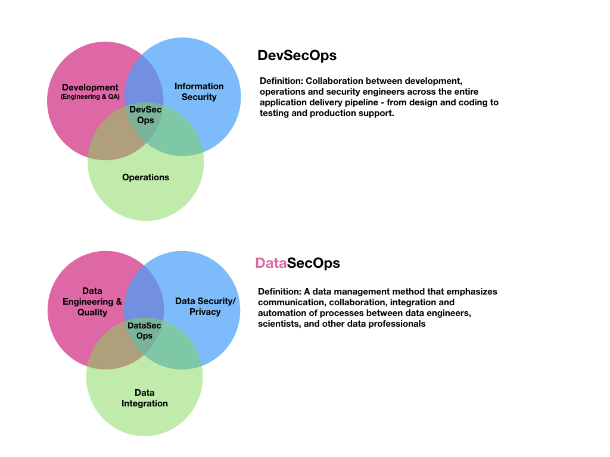

- 通过第一手的数据工作经验，知道要遵循什么安全措施或政策的痛苦，导致需要一个更好的机制，让开发、法律、安全、治理、风险、合规、数据管理员和数据所有者都能协作并自动执行他们的数据政策。
- 我们称之为DataSecOps。
- https://www.datasecops.info
-
- 应用程序向云的过渡和以更敏捷的方式开发软件带来了[[DevOps]]，几年后，一些数据泄露事件引发了这样的认识：安全需要被嵌入到DevOps过程中，而不是在一切都已就绪后再贴上附加物。因此，[[DevSecOps]]应运而生。
- 过了一段时间，数据才跟随应用程序，大规模迁移到云端。对于**数据**和应用来说，云计算的采用已经是一个既定事实。
- 在过去十年中，无需事先投资于服务器，就能存储和处理极其大量的数据的弹性和能力是数据驱动的创新的最佳催化剂之一。企业正在将大规模的数据仓库(data warehouses)、数据湖([[Data Lake]])和数据湖屋([[Data Lake House]])转移到云中。在许多情况下，数据消费者（如[[Redshift]]、[[BigQuery]]、[[Athena]]和[[Snowflake]]中的消费者）只需编写 "select"查询，就可以从巨大的表格中查询数据。换句话说，有了相当的基本技能，以及强大的BI工具的能力，大量的人可以利用组织的数据，这就是所谓的 "数据民主化([Data Democratization])"。
- 在这些过程中，更多的人和团队在不断地向组织的数据库中添加和消费新的数据，这使得数据团队不断发展，并采用[[DataOps]]思维。这意味着数据的摄取、准备、处理和消费是以更敏捷的方式进行的，这就要求处理数据的团队--如不同技能组合的数据工程团队--在脚本、自动化、测试、集成和生产部署方面拥有更多的技能。
- 举例：如果一家连锁酒店的数据科学家想知道哪些特征可以预测客人在入住前的24小时内会取消住宿，就可以用这些数据做很多事情（优化流程，有更好的容量规划等）。为此，他们需要大量的数据来学习。这些数据可能被保存在几个不同的部门，甚至是不同的地域。
- DataSecOps是组织将安全作为其数据运营的一部分的方式的演变。它是一种理解，即安全应该是数据操作流程的一个持续部分，而不是作为事后的考虑而添加的东西。事实上，DataSecOps应该被看作是数据民主化进程的推动者。
- 人们普遍认为，安全不是每年或每季度一次的临时性工作：数据变化的速度更快，更多的消费者不断加入，数据访问也不断变化。正如应用安全领域的产品周期变得更短一样，数据处理周期（从一个团队想要收集和处理数据，或者分析数据，直到他们能够这样做）也是如此。
- 数据民主化意味着更多的人能够访问更多的数据，如果安全不是操作的一个固定部分，那么对于有如此高的数据暴露的组织来说，风险水平就会太高。
- **如何成功启用DataSecOps**
- 生产数据也需要独立的暂存和测试环境，以便在满足生产之前对变化进行自动化和测试，而且这些分离包括确保生产数据的安全。
- 就处理数据的团队而言，DataSecOps思维是一种包容性的思维，它可能比DevOps流程中涉及更多的利益相关者。这可能包括工程、DevOps团队和IT团队。然而，它现在可能包括来自营销、财务、客户支持、销售和更多团队的数据监管人和数据所有者。这意味着，对安全（特别是数据安全）重要性的理解应该由更多的人分享。因此，拥有一个合作框架（比DevOps）更加重要，在这个框架中，安全不只是安全团队的问题，而是每个人都关心的问题--它该成为一个亮点。
- **共同的数据所有权，共同的责任**
- DataSecOps意味着不仅有一个围绕安全的共同思维，而且只要涉及到数据，不同团队之间就有一个共同的安全责任。
- DataSecOps也是一种理解，即许多组织现在正在处理大量的敏感数据，而这些信息在错误的人手中会造成很大的伤害。安全不仅是公司的巨大资产，也是一种巨大的责任，因为隐私和数据保护法规，以及数据暴露的风险。
- DataSecOps也是对数据驱动型组织中**时间-价值**的重要性的理解，安全不能成为数据处理生命周期中的一个延迟因素。举例来说，应该围绕风险与价值制定明确的指导方针，这样就可以在不需要具体批准的情况下使用项目的数据。
- 另一方面，DataSecOps也明白，尽管数据和数据驱动的价值是公司的重要组成部分，而且每个人都想从数据中获得更多，并更快地完成项目，但也不应该对安全水平大意妥协。
- DataSecOps认为，良好和灵活的数据治理是健康和安全的数据运行的一部分。这意味着，数据应该有明确的所有者，并且应该以安全而简单的方式进行访问。
- 此外，DataSecOps还承认，自动化和测试是区分成功和安全的数据操作与失败的数据操作的一个重要部分。因为小团队要处理大量的数据操作，人工工作可能意味着瓶颈或增加风险。
- 最后，DataSecOps是整体性的，因为它处理的是围绕数据的每一个过程--而不仅仅是在某些团队参与时。例如，它不仅仅是关于数据工程团队的，也不意味着一旦其他团队拉来数据，他们就 "不在 "DataSecOps流程的范围内。
- **定义**：
- `一种敏捷的、整体的、嵌入安全的方法来协调不断变化的数据及其用户，旨在提供快速的数据价值，同时保持数据的隐私、安全和良好的管理。`
- https://blog.satoricyber.com/what-is-datasecops/
-
- [[DevSecOps]] 是信息安全（ [[Information security]] ）、研发和运营的交汇；
- DataSecOps 是数据安全([[Data security]])、数据集成和数据工程的交汇；
- 