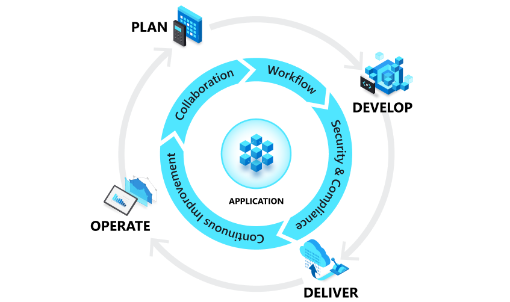

- What is DevOps? (Microsoft): https://docs.microsoft.com/en-us/devops/what-is-devops
- A compound of development (Dev) and operations (Ops), DevOps is the union of people, process, and technology ([[PPT]]) to continually provide value to customers.
- 
-