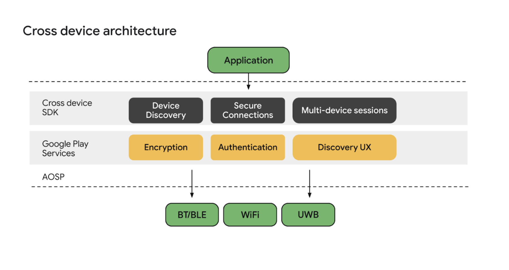

- 核心功能：
	- 设备发现和鉴权
	- 安全连接和数据传输
	- 多设备会话
-
- 示例场景
	- 多用户游戏
	- 生产力App的多设备无缝切换
	- 多人点单
-
- 创建抽象层、安全加速多设备开发的三项基本原则：
	- 泛在（Ubiquitous）：SDK需要在所有可能的设备上工作，起点是手机和平板；
	- 模块化（Modular）：开发者可以混合SDK与其他方案；
	- 使能（Empowering）：SDK不限制跨设备体验，而是允许构筑自己的功能和体验；
-
- 用例：
	- 个人体验（同用户ID，多设备）
		- 在手机上付费，在电视上完成影片租赁或者购买
		- 在手机上阅读文章，切换到平板；
	- 共享体验（Communal）
		- 作为乘客，和司机朋友共享位置
		- 和朋友分享周末骑行路线
		- 团体外卖，不需要传递个人手机
		- 群投票，决定看哪个电影
	- 媒体和其他体验
	- 媒体控制接续和认证
	- Cast SDK: 媒体播放到其他设备
	- Media sessions: 接续录像
	- [[Android Blockstore]]：认证
	- [[Companion device pairing]]：设备配对，如健身手环、耳机
	-
- 原理
-
- 
- Cross device SDK architecture
- 支持 [[Bluetooth]]、[[BLE]]、[[Wi-Fi]]、[[UWB]] 等多种连接。
-
- 多数开发者可以使用多设备会话(Multi-device sessions) API。如果需要细粒度控制或者定制，可以使用设备发现(Device Discovery)和安全连接(Secure Connections) API.
-
- Ref:
- https://developer.android.google.cn/guide/topics/connectivity/cross-device-sdk/overview