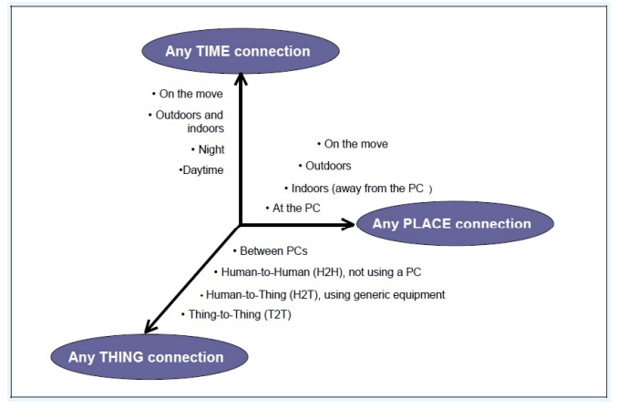

- In its 2005 IoT report, ITU describes the IoT as a “ubiquitous network,” in which the concept of ubiquitous networks is founded upon the all inclusive use of networks and networked devices (ITU, SERIES Y, 2005).
- Accordingly, #ITU endorses the definition of IoT as a network that is: “Available anywhere, anytime, by anything and anyone.”
- 
-