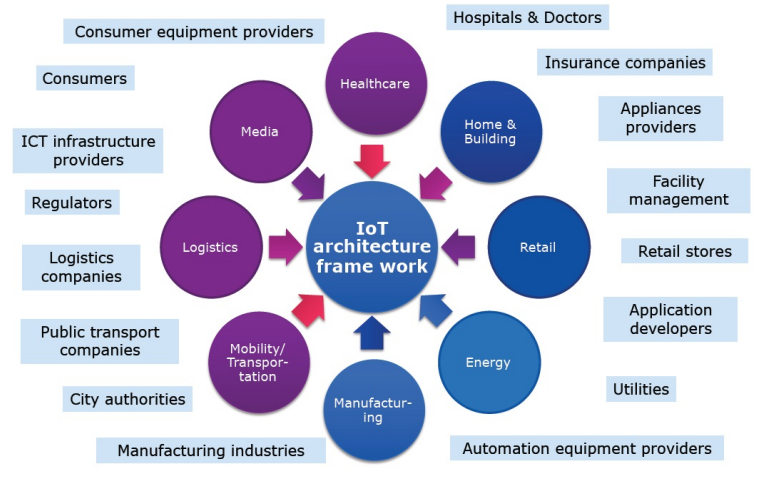

- 
- IoT scenarios:
	- Healthcare
	- Home and Building
	- Retail
	- Energy
	- Manufacturing
	- Mobility or Transportation
	- Logistics
	- Media
-
- #IEEE: Towards a definition of the Internet of Things ( #IoT )