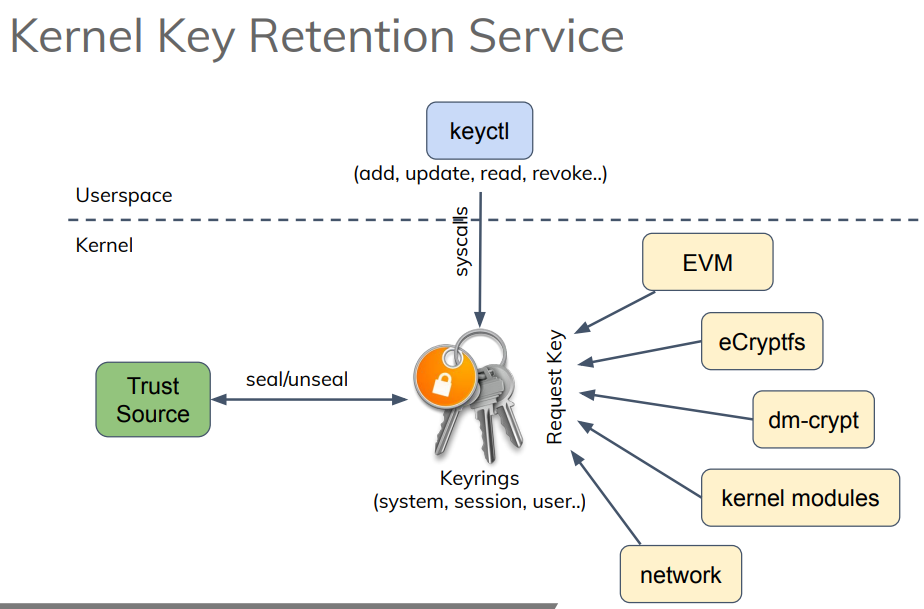

- 内核中的密钥管理服务。允许在内核缓存密钥信息。
- 部件：
- [[keyctl]]：用户空间的密钥管理
- [[Keyrings]]：内核空间的密钥管理
	- 请求密钥的服务包括：
		- [[EVM]]
		- [[eCryptfs]]
		- [[dm-crypt]]
		- 内核模块
		- 网络
- Ref: SAN19-413: [[TEE]] based Trusted Keys in #Linux
- 