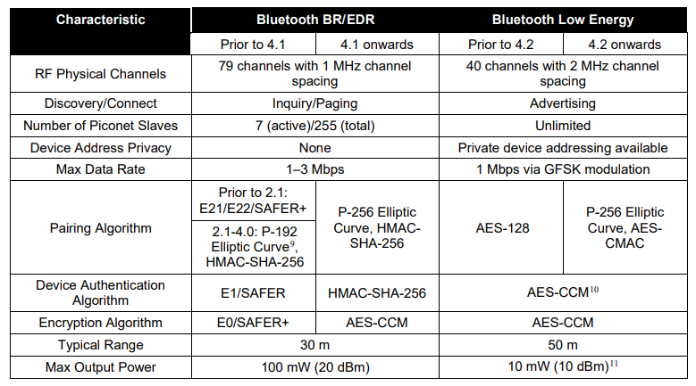

- Guide to #Bluetooth Security
- https://nvlpubs.nist.gov/nistpubs/SpecialPublications/NIST.SP.800-121r2-upd1.pdf
- 蓝牙 BR [[EDR]] HS的安全特性
	- 配对和链接密钥生成
	- 认证
	- 机密性保护
	- 信任等级，服务安全等级，授权
- 蓝牙 [[BLE]] 的安全特性
	- 安全模式和等级
	- 配对方式
	- 密钥生成与分发
	- 安全连接（Secure Connection）密钥生成
	- 机密性、鉴权和完整性
	- 从连接密钥派生长期密钥
	- 从长期密钥派生连接密钥
- BR EDR与BLE的区别：
- 
-