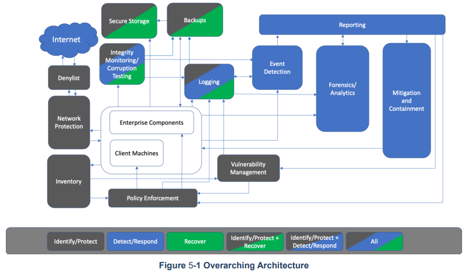

- NIST [[Cybersecurity]] WHITE PAPER - SECURING [[DATA INTEGRITY]] AGAINST [[RANSOMWARE]] ATTACKS
-
- [[Data Integrity]]
	- [[SP 1800-25]]: Identify, Protect
	- [[SP 1800-26]]: Detect, Respond
	- [[SP 1800-11]]: Recover
- [[Data Confidentiality]]
	- [[SP 1800-28]]
	- [[SP 1800-29]]
- [[Data Availability]]
	- N/A
- #CSF #NIST #IPDRR
-
- 
- #Overarching
-