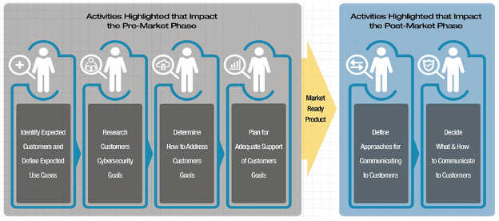
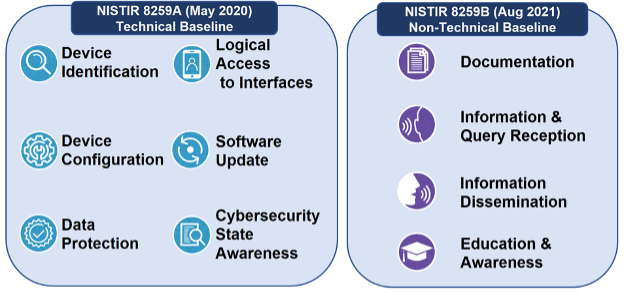

- NISTIR 8259 系列报告为制造商及其支持第三方提供指导，帮助他们构思、设计、开发、测试、销售和支持其客户范围内的物联网设备([[IoT]])。该系列包括三份最终文件和一份草案文件：
	- NISTIR 8259：针对物联网设备制造商的建议：基础活动（2020 年 5 月 29 日）
	- [[NISTIR 8259A]]：核心设备网络安全能力基线（2020 年 5 月 29 日）
	- [[NISTIR 8259B]]：物联网非技术支撑能力核心基线（2021年8月25日）
- NISTIR 8259 定义了一系列活动供物联网制造商在开发和支持物联网设备时遵循。
- 
- NISTIR 8259A 和 8259B 对 NISTIR 8259 中描述的活动进行了补充，提供了制造商在产品设计和支持计划中应考虑的特定技术能力和非技术支持活动，以帮助确保他们满足客户物联网网络安全需求和目标：
- {:height 300, :width 624}
-
- 8259A:
	- 设备识别(Device Identification)
	- 设备配置(Device Configuration)
	- 数据保护(Data Protection)
	- 接口的逻辑访问
	- 软件更新
	- 网络安全状态感知
-
- 8259B：
	- 文档
	- 信息和咨询接待
	- 信息传播
	- 教育和意识
-
- https://www.nist.gov/itl/applied-cybersecurity/nist-cybersecurity-iot-program/nistir-8259-series