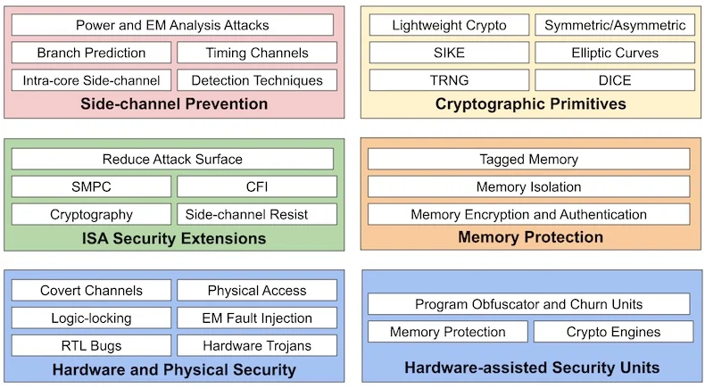

- https://www.allaboutcircuits.com/news/sifive-gives-its-worldguard-security-model-to-the-risc-v-community/
- 
-
- Side-channel Prevention
- Crypto Primitives
	- [[Lightweight Crypto]]
	- 对称，非对称密码原语
	- [[SIKE]]
	- [[TRNG]]
	- 椭圆曲线（[[ECC]]）
	- [[DICE]]
- ISA Security Extensions
	- 减少攻击面
	- [[SMPC]]
	- CFI
	- 密码学
	- 侧信道抵抗
- Memory Protection
	- [[Tagged Memory]]
	- 内存隔离
	- 内存加密与认证
- Hardware and Physical Security
- Hardware-assisted Security Units
-