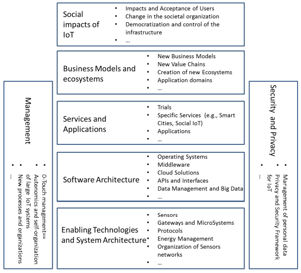

- 
- Enabling Technologies and System Architecture
- Software Architecture
- Services and Apps
- Business Models and ecosystems
- Social impacts of #IoT
- Management
	- Zero-Touch management
	- Autonomics and self organization of large IoT systems
	- New processes and organizations
	-
- #Security and #Privacy
	- Management of personal data
	- Privacy and Security Framework for IoT
-
- Ref: #IEEE: Towards a definition of the Internet ofThings ( #IoT )