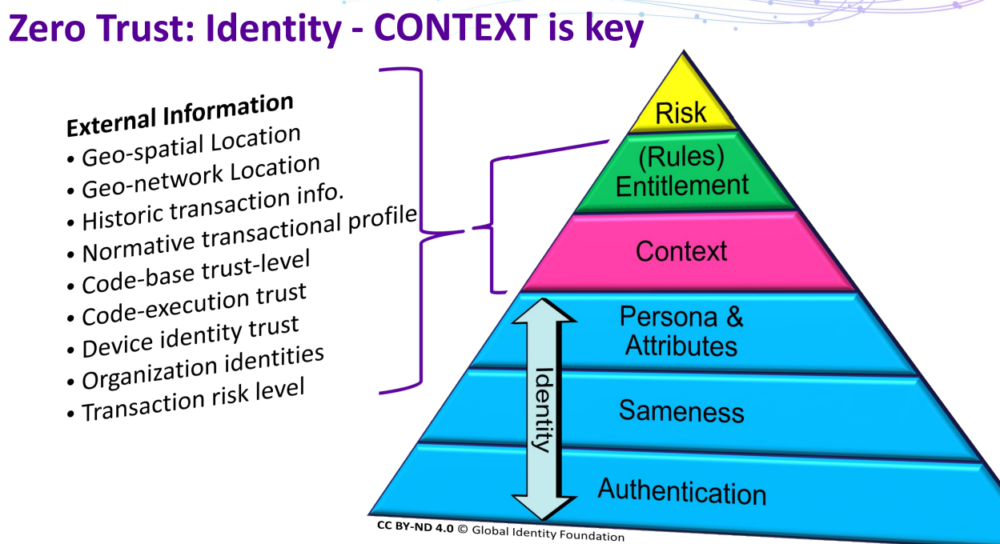

- Layers
	- Risk 风险
	- (Rules) Entitlement 资格
	- Context 上下文
	- Persona & Attributes 角色和属性
	- Sameness 同一性
	- Authentication 验证
- External Information（外部信息，归属于资格与上下文）
	- Geo-spatial Location 地理空间位置
	- Geo-network Location 地理网络位置
	- Historic transaction info. 历史交易信息
	- Normative transactional profile 规范的交易概况
	- Code-base trust-level 基于代码的信任级别
	- Code-execution trust 代码执行信任
	- Device identity trust 设备身份信任
	- Organization identities 组织身份
	- Transaction risk level 交易风险等级
- 
- #RSA
- RSA2019/str-w12-the-fallacy-of-the-zero-trust-network
- #ZeroTrust
-